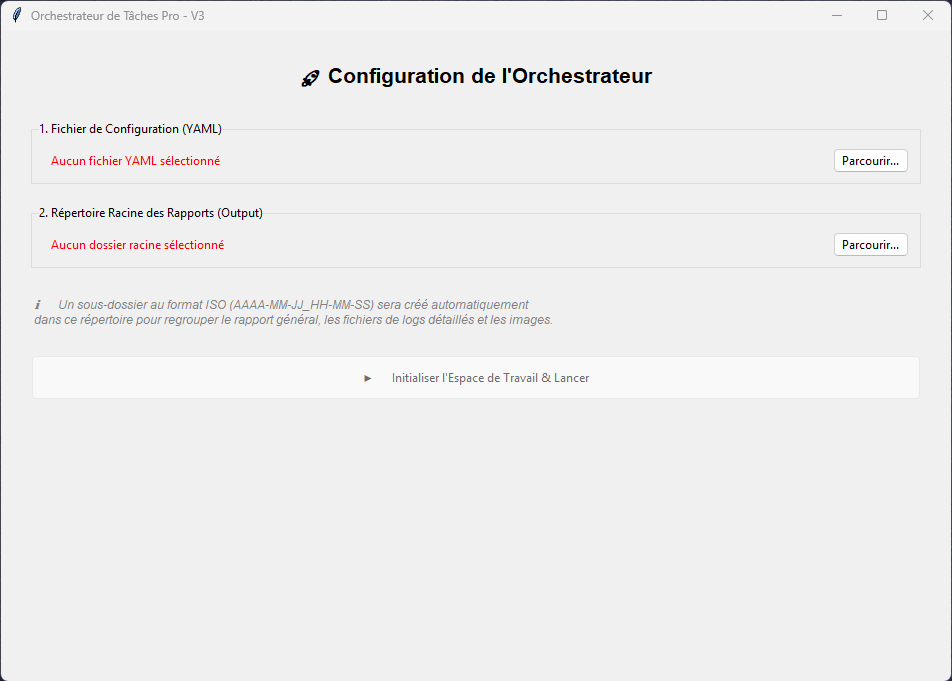
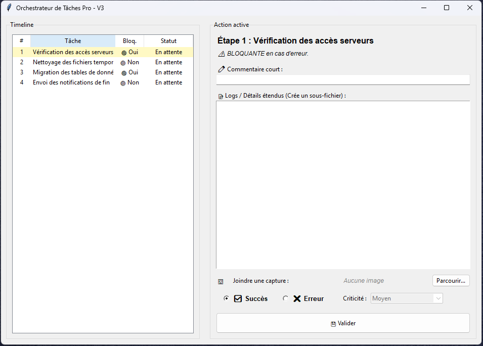

# 🚀 Orchestrateur de Tâches Automatisé


Une application de bureau Windows légère et autonome, développée en Python, permettant d'orchestrer, de suivre et de documenter l'exécution d'une série de tâches définies dans un fichier YAML. Idéal pour les déploiements, les migrations système, les tests QA ou toute checklist de production nécessitant un reporting rigoureux.

---

## ✨ Fonctionnalités

- **Interface Graphique Native** : Interface épurée sous Windows via Tkinter/ttk.
- **Configuration par YAML** : Importation dynamique des étapes à réaliser depuis un simple fichier `.yml`.
- **Statuts et Blocages** : Prise en charge de tâches "bloquantes" qui interrompent automatiquement le processus en cas d'erreur de sécurité.
- **Gestion fine des Erreurs** : Catégorisation des anomalies (Faible, Moyen, Critique).
- **Reporting Markdown Automatisé** :
  - Génération d'un tableau de bord général (`rapport_general.md`).
  - Scission intelligente des logs longs dans des sous-fichiers dédiés.
  - Liens de navigation cliquables entre le rapport principal et les détails.
- **Preuves Visuelles** : Possibilité d'attacher des captures d'écran directement liées aux étapes.
- **Organisation Intelligente (Zéro Config)** : Génération automatique d'un répertoire `RAPPORT_TACHE` au même niveau que le fichier YAML, classé par dossiers horodatés (Norme ISO).

---

## 🛠️ Prérequis et Installation

1. Assurez-vous d'avoir [Python 3.8+](https://www.python.org/downloads/) installé sur votre machine.
2. Clonez ce dépôt sur votre machine locale :
   ```bash
   git clone [https://github.com/votre-nom-utilisateur/votre-repo.git](https://github.com/votre-nom-utilisateur/votre-repo.git)
   cd votre-repo
```
(Optionnel mais recommandé) Créez et activez un environnement virtuel (Workspace) :
   ```bash

python -m venv venv
venv\Scripts\activate
```

Installez les dépendances requises :
   ```bash

    pip install pyyaml
```

## 🚀 Utilisation

1.    Préparez votre fichier de configuration Créez un fichier .yml (par exemple taches.yml) contenant vos étapes. Voici le format attendu :

    YAML

```yaml
taches:
  - id: 1
    nom: "Sauvegarde de la base de données"
    bloquante: true
  - id: 2
    nom: "Nettoyage des fichiers temporaires"
    bloquante: false
  - id: 3
    nom: "Déploiement de la mise à jour"
    bloquante: true
```

2. Lancez l'application

```bash

    python app.py
```
3. Exécutez vos tâches

    *    Cliquez sur "Ouvrir un fichier..." et sélectionnez votre .yml.

    *    L'interface d'exécution s'ouvre.

    *    À chaque étape, indiquez un succès ou une erreur, ajoutez des commentaires, des logs techniques ou des captures d'écran.

    *    Cliquez sur "Valider l'étape et Enregistrer".

## 📁 Structure des Rapports Générés

Dès le lancement de l'exécution, l'application crée automatiquement l'arborescence suivante sans aucune intervention manuelle :

```plaintext

📁 Dossier_de_votre_YAML/
 ├── 📄 taches.yml
 └── 📁 RAPPORT_TACHE/
      └── 📁 2026-06-19T14-30-00/                   <-- Dossier d'exécution horodaté
           ├── 📄 rapport_general.md                <-- Rapport global avec tableau de synthèse
           ├── 📄 etape_2_details.md                <-- (Optionnel) Fichier de logs si détails étendus
           └── 🖼️ etape_2_capture.png               <-- (Optionnel) Pièce jointe copiée automatiquement
```

## 📸 Aperçu de l'application


Sélection du fichier de configuration.



Suivi de la timeline et saisie des observations



## 📝 Licence MIT

Ce projet est sous licence MIT. Voir le fichier LICENSE pour plus de détails.